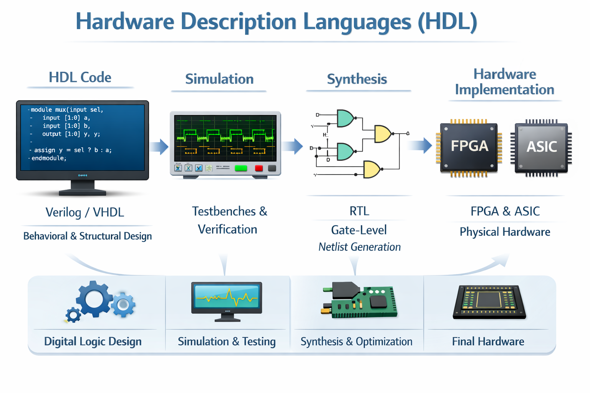

# Hardware Description Languages (HDL)

Hardware Description Languages (HDLs) are specialized programming languages used to describe, design, and verify digital hardware systems. Unlike traditional software languages that execute sequential instructions on a processor, HDLs describe hardware structures and behavior that operate concurrently and are physically implemented as electronic circuits.

Common HDLs such as Verilog, SystemVerilog, SystemC and VHDL are widely used in FPGA and ASIC development to design components like processors, memory systems, communication interfaces, and accelerators. These languages allow engineers to model hardware at different abstraction levels — from behavioral descriptions to gate-level implementations — enabling simulation, synthesis, and physical realization.

## About This Repository

The goal of this repository is to provide benchmarks and structured examples that explain and demonstrate the development of digital designs using HDL.

Instead of presenting isolated code snippets, this project focuses on:

- Progressive design examples (from simple modules to complex systems)
- Clear explanation of design decisions
- Performance-oriented implementations
- Synthesis-aware coding practices
- Verification and testbench strategies

These benchmarks aim to serve as:

- 📘 A learning resource for students and beginners
- 🧪 A reference for experimentation and optimization
- 🏗 A foundation for performance and architectural exploration
- 🔬 A base for research and hardware evaluation

By studying these benchmarks, users can better understand how HDL code translates into hardware structures and how design choices impact area, timing, and power.