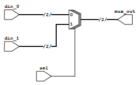

# Mux



# How to build and execute

```
iverilog tb_mux.v mux.v
./a.out
```

# Output

```
Time  | sel din_0 din_1  | mux_out
--------------------------------
10000 |  0    00    11   |   00
20000 |  1    00    11   |   11
30000 |  0    10    01   |   10
40000 |  1    10    01   |   01
tb_mux.v:56: $finish called at 40000 (1ps)
```
